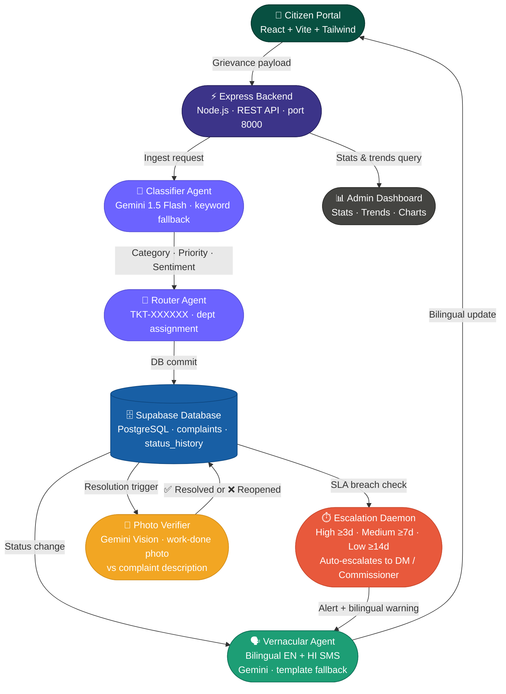

<div align="center">

# 🏛️ Jansunwai AI Portal

### AI-Powered Civic Grievance Resolution for Smarter Governance
**Turning citizen complaints into verified resolutions — at the speed of AI.**

[](https://github.com)


**[🚀 Demo Walkthrough](#-demo-walkthrough) · [⚙️ Setup](#-setup--installation) · [🗺️ Roadmap](#-future-roadmap) · [👥 Team](#-team)**

</div>

---

## 🇮🇳 The Problem We're Solving

Government grievance portals like Uttar Pradesh's **Jansunwai** receive **millions of complaints annually**. Yet resolution consistently collapses under:

| Pain Point | Reality |
|---|---|
| 🐌 **Manual triaging** | Officers spend hours reading and sorting complaints |
| 🔀 **Wrong department routing** | Tickets bounce between departments for weeks |
| 🌑 **Zero transparency** | Citizens file a complaint and hear nothing back |
| 🗣️ **Language barriers** | Portals are English-first; citizens speak Hindi, Bhojpuri, Awadhi |
| 🎭 **Fake closures** | Officials mark tickets "Resolved" without doing actual work |

**Jansunwai AI Portal closes every one of these gaps** with an end-to-end agentic pipeline powered by generative AI.

---

## ✨ Feature Highlights

<table>
<tr>
<td width="50%">

**🤖 AI Grievance Classification**
Gemini 1.5 Flash instantly detects intent, extracts keywords, assigns category, priority, and sentiment from free-form citizen text.

</td>
<td width="50%">

**📬 Intelligent Auto-Routing**
Complaints are automatically assigned to the correct department — PWD, UPPCL, Sanitation, Health, CMO — with SLA priority levels.

</td>
</tr>
<tr>
<td>

**⏱️ Autonomous SLA Escalation**
A daemon scheduler watches every open ticket. When an SLA is breached, it auto-escalates to the DM/Commissioner without any human trigger.

</td>
<td>

**📲 Vernacular Bilingual Notifications**
Citizens receive bilingual EN + HI updates at every stage — submission, assignment, escalation, and resolution.

</td>
</tr>
<tr>
<td>

**📊 Admin Analytics Dashboard**
Real-time oversight portal with stats, workload distribution, and daily filed/resolved trend charts.

</td>
<td>

**🔁 Heuristic Fallback Engine**
Local keyword-based classifier activates automatically when no API key is present — full pipeline stays operational for offline demos.

</td>
</tr>
</table>

---

## 🛠️ Tech Stack

### Core Infrastructure

| Layer | Technology |
|---|---|
| **Frontend** | React (Vite) + Tailwind CSS |
| **Backend** | Node.js + Express 4 |
| **Database** | Supabase (PostgreSQL) via `@supabase/supabase-js` |

### AI & Intelligence

| Tool | Role |
|---|---|
| **Google Gemini 1.5 Flash** | Core classification agent — category tagging, priority scoring, sentiment analysis, bilingual SMS drafting |
| **Heuristic Fallback Engine** | Local keyword-based classifier — activates automatically when no API key is present |

---

## 🏗️ Architecture



---

## 📁 Project Structure

```
jansunwai-fullstack/
├── backend/
│   ├── src/
│   │   ├── agents/
│   │   │   ├── classifier.js      # Gemini AI classification agent
│   │   │   ├── escalator.js       # SLA breach & auto-escalation daemon
│   │   │   ├── router.js          # Department routing + ticket ID generation
│   │   │   └── vernacular.js      # Bilingual EN/HI SMS drafting agent
│   │   ├── db/
│   │   │   └── database.js        # Supabase client + seed data
│   │   ├── routes/
│   │   │   └── complaints.js      # All complaint API route handlers
│   │   └── index.js               # Express app entry point
│   ├── supabase_schema.sql         # Database schema — run once in Supabase
│   ├── package.json
│   └── .env.example
│
└── frontend/
    ├── src/
    │   ├── pages/
    │   │   ├── AdminDashboard.jsx  # Admin oversight panel
    │   │   ├── ComplaintDetails.jsx
    │   │   ├── SubmitComplaint.jsx # Citizen complaint form
    │   │   ├── TrackComplaint.jsx  # Tracking by ticket ID
    │   │   ├── Analytics.jsx       # Trends & charts
    │   │   └── Login.jsx
    │   ├── services/
    │   │   └── api.js              # All frontend API calls
    │   └── App.jsx
    ├── index.html
    └── package.json
```

---

## ⚙️ Setup & Installation

### Prerequisites


---

### 1. 🗄️ Supabase Setup (One-Time)

1. Go to [supabase.com](https://supabase.com) → **New Project**
2. Open **SQL Editor → New Query**, paste `backend/supabase_schema.sql`, and **Run**
3. Go to **Settings → API** and note:
   - **Project URL** → `SUPABASE_URL`
   - **service_role** key → `SUPABASE_SERVICE_ROLE_KEY`

---

### 2. 🟢 Backend Setup

```bash
cd backend
cp .env.example .env
```

Fill in your `.env`:

```env
PORT=8000
SUPABASE_URL=https://your-project-id.supabase.co
SUPABASE_SERVICE_ROLE_KEY=your-service-role-key-here
GEMINI_API_KEY=your-gemini-api-key-here     # optional — keyword fallback used if absent
```

```bash
npm install
npm run dev     # starts on http://localhost:8000
```

> 💡 **No Gemini key?** Jansunwai automatically activates a local keyword-based heuristic classifier — classification, priority, routing, and all other features stay fully functional.

On first boot, the server **auto-seeds 6 sample complaints** if the table is empty.

---

### 3. ⚛️ Frontend Setup

```bash
cd frontend
cp .env.example .env    # default: VITE_API_URL=http://localhost:8000/api
npm install
npm run dev             # starts on http://localhost:5173
```

**Open → `http://localhost:5173`**

---

## 🌐 API Reference

| Method | Endpoint | Description |
|--------|----------|-------------|
| `POST` | `/api/complaints` | File new complaint (AI classification + routing) |
| `GET`  | `/api/complaints` | List — filters: `search`, `category`, `status`, `priority`, `department` |
| `GET`  | `/api/complaints/:id` | Detail + full status history |
| `POST` | `/api/complaints/:id/status` | Update status: `In Progress` / `Resolved` / `Escalated` |
| `POST` | `/api/simulate-tick` | Simulate 2-day time advance (triggers auto-escalation) |
| `GET`  | `/api/stats` | Dashboard statistics (optional `?department=`) |
| `GET`  | `/api/trends` | Daily filed/resolved trend data (optional `?days=14`) |

---

## 🎥 Demo Walkthrough

> From complaint to resolution in under 2 minutes.

**Step 1 — Submit a Complaint**
A citizen types (or pastes) a grievance:
> *"Sector 4 ke main crossing road par bade bade gaddhe ho gaye hain, do-wheeler gir rahe hain."*

**Step 2 — AI Analysis** *(< 1 second)*
Click **"File Official Grievance"** and watch the agents work:
```
Category   →  Roads
Department →  Public Works Department (PWD)
Priority   →  🔴 HIGH  (accident safety risk detected)
Ticket ID  →  TKT-XXXXXX
```

**Step 3 — Citizen Notification**
A bilingual SMS log is recorded instantly:

| Language | Message |
|---|---|
| 🇬🇧 English | *"Your complaint has been assigned to Public Works Department..."* |
| 🇮🇳 Hindi | *"आपकी शिकायत Public Works Department को सौंप दी गई है।"* |

**Step 4 — Admin SLA Escalation**
Switch to the **Admin Panel** → click **"Simulate 48h SLA Tick"**:
- All tickets are aged by the daemon
- High-priority tickets older than 3 days → **auto-escalated to District Commissioner**
- Bilingual warning notifications dispatched to citizen

---

## 🚀 Deployment

| Part | Recommended |
|------|-------------|
| Frontend | Vercel — connect repo, set `VITE_API_URL` |
| Backend | Railway or Render — set all 3 env vars |
| Database | Supabase (already hosted) |

Set `VITE_API_URL` in Vercel to your Railway/Render backend URL, e.g.
`https://jansunwai-backend.railway.app/api`

---

## 🤖 AI Agents

| Agent | File | Description |
|---|---|---|
| **Classifier** | `agents/classifier.js` | Gemini 1.5 Flash — category, priority, sentiment. Falls back to keyword rules. |
| **Router** | `agents/router.js` | Generates `TKT-XXXXXX` ticket IDs and writes the Assigned log entry. |
| **Vernacular** | `agents/vernacular.js` | Bilingual EN/HI citizen SMS via Gemini (template fallback). |
| **Escalator** | `agents/escalator.js` | Auto-escalates on SLA breach: High ≥ 3d, Medium ≥ 7d, Low ≥ 14d. |

---

## 🔮 Future Roadmap

| Feature | Description |
|---|---|
| 🗺️ **District Heatmaps** | Geotagged density maps of civic issues to assist district budget planning |
| 🤖 **WhatsApp Bot** | File and track complaints via interactive WhatsApp dialogue — zero app install |
| 📸 **Photo-Verified Resolution** | Gemini Vision cross-checks "work done" photos against complaint descriptions |
| 🔍 **Duplicate Detection** | Vector database clustering to group similar complaints from multiple citizens |
| 🖼️ **Full OCR Pipeline** | Scan uploaded grievance documents and handwritten letters for automated intake |

---

## 📄 License

This project was built for the Build with AI: Agentic Premier League Hackathon. See `LICENSE` for details.

---

<div align="center">

**जनसुनवाई — आपकी आवाज़, हमारी जिम्मेदारी।**
*Jansunwai — Your Voice, Our Responsibility.*


</div>
